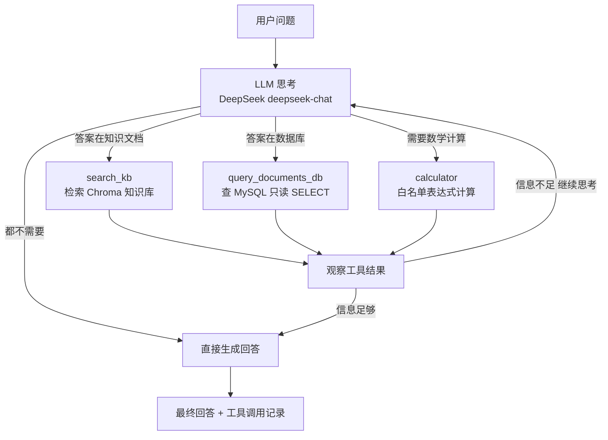

# Agent Architecture - kb-assistant

> Mermaid 图，GitHub 自动渲染。可在 https://mermaid.live 预览。



## 流程说明

- Agent 用 Function Calling + ReAct 循环（思考→行动→观察），最多 10 轮
- LLM 根据工具 description 决定调用哪个工具；工具结果以 role=tool 加回对话
- SQL 工具只允许 SELECT（防注入/防破坏）；计算器有字符白名单
- 轮数上限作为安全阀，防止死循环无限消耗 API
```

