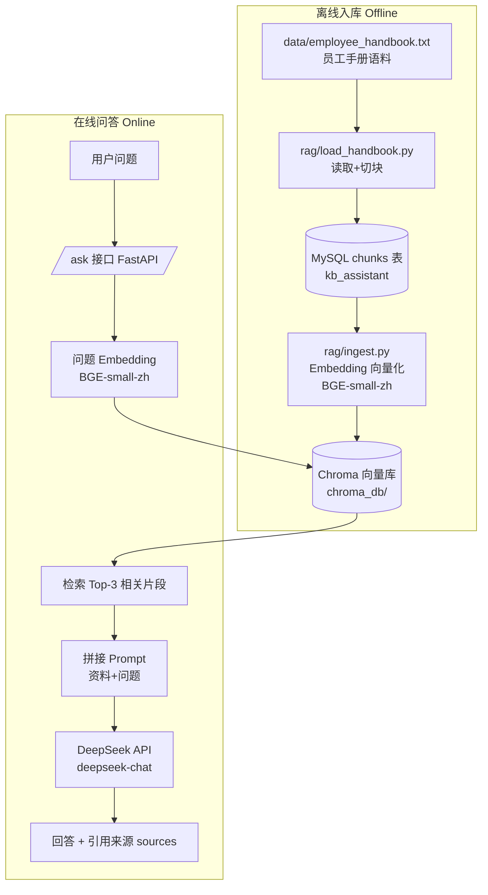

# RAG Architecture - kb-assistant

> 本图用 Mermaid 绘制，GitHub 会自动渲染。也可在 https://mermaid.live 粘贴预览。

## 系统架构

## 流程说明

- **离线入库**（文档上传时执行一次）：员工手册 → 切块存 MySQL chunks 表 → embedding 向量化 → 存 Chroma
- **在线问答**（每次提问执行）：问题向量化 → Chroma 检索最相关 3 块 → 拼 prompt → DeepSeek 生成回答 → 返回回答与引用来源
- 关键文件：`rag/splitter.py`（切块函数）、`rag/load_handbook.py`（入库 MySQL）、`rag/ingest.py`（入库 Chroma）、`rag/query.py`（问答）、`main.py`（/ask 接口）
