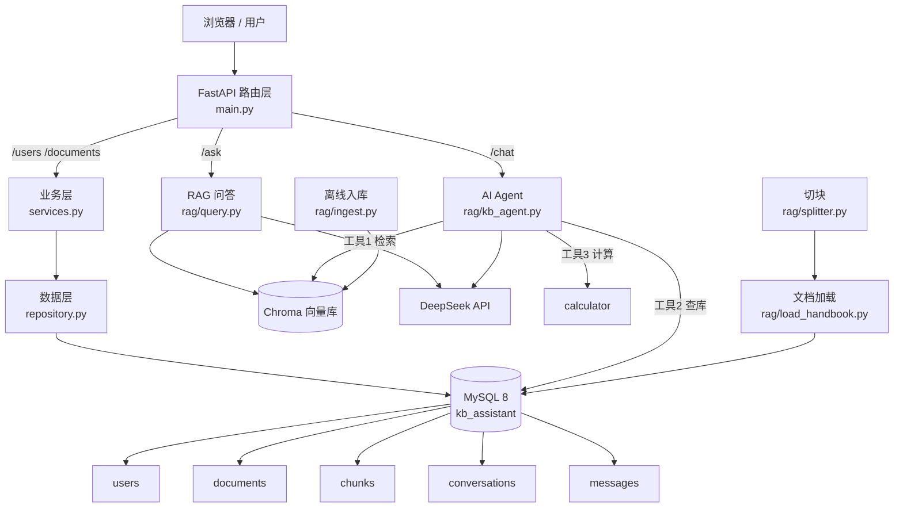

# System Architecture - kb-assistant

> 企业知识库智能助手 —— 完整系统架构
> 本图用 Mermaid 绘制，GitHub 自动渲染。可在 https://mermaid.live 预览。

## 总体架构



## 分层说明

| 层 | 文件 | 职责 |
|---|---|---|
| 路由层 | `main.py` | 接收 HTTP 请求、定义 API 路径、返回响应 |
| 业务层 | `services.py` | 业务规则（如：新建文档前校验用户存在） |
| 数据层 | `repository.py` | 所有 SQL 操作，唯一直接访问 MySQL 的层 |
| RAG | `rag/` | 切块、向量化、检索、问答 |
| Agent | `rag/kb_agent.py` | ReAct 循环 + 三个工具（检索/查库/计算器） |

## 两条流水线

**离线入库（文档上传时执行一次）**
```
原始文档 → splitter.py 切块 → load_handbook.py 存 MySQL chunks 表
        → ingest.py 向量化 → 存入 Chroma 向量库
```

**在线问答（每次请求）**
```
用户问题 → main.py 路由
  ├─ /ask  → 检索 Chroma Top-3 → 拼 prompt → DeepSeek → 带引用回答
  └─ /chat → Agent(ReAct) 自主选择工具 → 执行 → 观察 → 生成回答
```

## 外部依赖

| 组件 | 用途 |
|---|---|
| MySQL 8 | 业务数据（用户、文档、切块、会话、消息） |
| Chroma | 向量数据库（存储文档切块的 embedding） |
| BGE-small-zh-v1.5 | 中文 embedding 模型（文本 → 向量） |
| DeepSeek API | LLM 生成（deepseek-chat） |
| FastAPI + uvicorn | Web 服务框架 |
